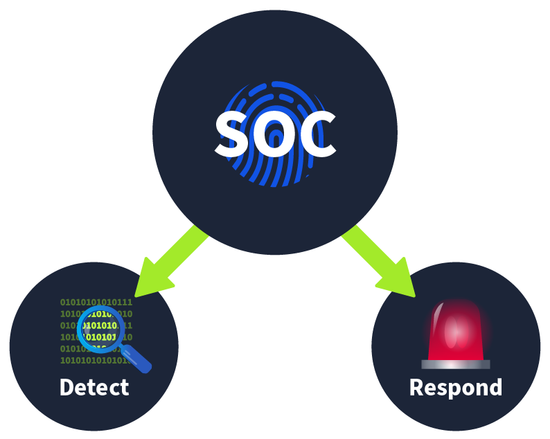

# SOC L1 Journey

## SOC FUNDAMENTALS:-

A **SOC** (**S**ecurity **O**perations **C**enter) is a dedicated facility operated by a specialized security team. This team aims to continuously monitor an organization’s network and resources and identify suspicious activity to prevent damage. This team works 24 hours a day, seven days a week.

**Your Daily Duties**

As a Junior Security Analyst, also called a SOC Level 1 Analyst, you work in a 24/7 SOC team and mostly review the security alerts together with your colleagues. To do it efficiently, you will need practice and skills learned through this path. During your work shift, you would typically:

- Monitor and investigate various security alerts
- Participate in  brainstorms and workshops
- Cooperate with other teams to keep your company safe
- Constantly learn and discover new attacks and defenses

The main focus of the SOC team is to keep **Detection** and **Response** intact. The SOC team has some resources available in the form of security solutions that help them achieve this. These solutions integrate the whole company’s network and all the systems to monitor them from one centralized location. Continuous monitoring is required to detect and respond to any security incident.

**Detection:-**

- Detect vulnerabilities
- Detect unauthorized activity
- Detect policy violations
- Detect intrusions

**Response:-**

- **Support with the incident response**

- The **People** are known as the SOC team. This team has the following roles and responsibilities.

- Each role has its own **Processes**, just as we saw the role of Level 1 SOC Analysts as the first responders to carry out alert triage and determine if it is harmful. Let’s discuss some important processes involved in a SOC.

- The **Technology** portion in the SOC pillars refers to the security solutions. These security solutions efficiently minimize the SOC team's manual effort to detect and respond to threats.
- Example:-EPP, IDS/IPS, XDR, SOAR, and more.

## **Scenario**

You are the Level 1 Analyst of your organization’s SOC team. You receive an alert that a port scanning activity has been observed on one of the hosts in the network. You have access to the SIEM solution, where you can see all the associated logs for this alert. You are tasked to view the logs individually and answer the question to the 5 Ws given below.

**Note**: The vulnerability assessment team notified the SOC team that they were running a port scan activity inside the network from the host: `10.0.0.8`

| **Case** | **Actual Situation** | **SIEM Alert** | **Example in Your Scenario** | **Conclusion** |
| --- | --- | --- | --- | --- |
| **True Positive (TP)** | Real malicious port scan | Alert generated | Unknown attacker scanning network | ✅ Correct detection |
| **False Positive (FP)** | Legitimate activity | Alert generated | Vulnerability team (IP: 10.0.0.8) scanning | ❌ Benign but flagged |
| **True Negative (TN)** | No attack | No alert | Normal network traffic | ✅ Correctly ignored |
| **False Negative (FN)** | Real malicious port scan | No alert | Attacker scans but SIEM misses it | ❌ Missed threat |

Scenario Answer

| **Observed Activity** | **Source IP** | **Reality** | **Alert Status** | **Result** |
| --- | --- | --- | --- | --- |
| Port Scan | 10.0.0.8 | Authorized (Vuln Team) | Alert Triggered | **False Positive** |

Easy Way to Remember

- True = Correct
- False = Wrong
- Positive = Predicted YES
- Negative = Predicted NO

## **Security Hierarchy**

Cyber security priorities are different for every company. For law firms, the goal is the privacy of the legal documents. For factories, the availability of production lines. For hospitals, patient safety. That's why every company has a unique security approach and security team structure. Let's take a look at the high-level example of it:

Blue Team is about defensive security, meaning it constantly monitors for attacks and tries to respond to them quickly. Depending on a company's size and sector, Blue Team can include a lot of different roles and subdepartments, usually counting 3 to 50 members total. Now, let's explore the most common Blue Team departments.

- **L1 Analysts**: Junior members who triage alerts and pass complex cases to L2
- **L2 Analysts:** Experienced members who investigate more advanced attacks
- **Engineers**: Experts in configuring security tools like  EDR or SIEM
- **Manager**: A person who manages the whole SOC  team
    
    ## **Cyber Incident Response Team (CIRT)**
    

**Specialized Defensive Roles**

## **Internal SOC vs MSSP**

| **Topic** | **Internal SOC** | **MSSP** |
| --- | --- | --- |
| **ScenarioExample** | You work in a SOC team of the bank and protect the bank's systems | You work for a global MSSP protecting its sixty customers in Europe |
| **WorkingPace** | You usually have calm shifts without too much time pressure | Your shift usually starts from a queue of urgent alerts to analyze |
| **SecurityTools** | You work with just a few tools, but need to know them very well | You have to work with sixty diverse security tools and platforms |
| **IncidentPractice** | You saw and learned from just two major cyber attacks last year | Every week, you deal with attacks and breaches, and can learn from it |

## **Next Steps**

Your most natural next step after L1 is to become a SOC L2 analyst, but you are free to choose another path! While handling a SIEM alert, you might notice that engineering work appeals to you more. During a cyber attack, you may be fascinated by CIRT actions. You may also find yourself well-suited as a manager and build your path to the CISO role. No matter what, your first year or two is to get real work experience, and to spend this time effectively, follow the tips below!

## **Humans as Attack Vectors**
