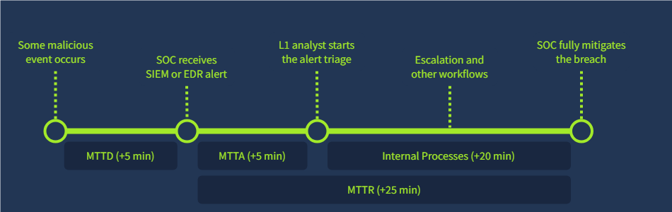

# SOC Metrics and Objectives

**Core Metrics**

The main goal of a SOC - to protect the confidentiality, integrity, and availability of the organisation's digital assets. The SOC team performs its purpose by developing, receiving, and triaging alerts. The L1 analysts' role in this process is to reliably report True Positives to the higher level, to L2. This leads us to the first four metrics:

| **Metric** | **Formula** | **Measures** |
| --- | --- | --- |
| Alerts Count | `AC = Total Count of Alerts Received` | Overall load of SOC analysts |
| False Positive Rate | `FPR = False Positives / Total Alerts` | Level of noise in the alerts |
| Alert Escalation Rate | `AER = Escalated Alerts / Total Alerts` | Experience of L1 analysts |
| Threat Detection Rate | `TDR = Detected Threats / Total Threats` | Reliability of the SOC team |

**Triage Metrics**

remember that an alert by itself will not stop the breach, and it is important to timely receive the alert, triage it, and respond to the attack before the attackers achieve their goals. The requirements to ensure a quick detection and remediation of the threat are commonly grouped into a **Service Level Agreement (SLA)** - a document signed between the internal SOC team and its company management, or by the managed SOC provider (MSSP) and its customers. The agreement usually requires quick threat detection (measured by **MTTD**), timely alert acknowledgement by L1 analysts (measured by **MTTA**), and finally, prompt response to the threat, like isolating the device or securing the breached account (measured by **MTTR**):

# Scenario

Imagine a scenario where an employee was lured into running data stealer malware.

The SOC team received the "Connection to Redline Stealer C2" alert after 12 minutes.

One of the L1 analysts on shift moved the alert to In Progress 10 minutes later.

After 6 minutes, the alert was escalated to L2, who spent 35 minutes cleaning the malware.
Provide the MTTD, MTTA, and MTTR via comma as your answer (e.g. 10,20,30).

Answer:12,10,51

**Improving Metrics**

Now that we know a lot about different metrics, why would it matter to you as an L1 analyst? First, you should understand that metrics were built to make the SOC more efficient and, therefore, to make the attacks far less successful. Second, the metrics are often used to evaluate your performance, and good results lead to career growth and a raise to more senior positions like L2 analyst. So, how can you improve the metrics?

| **Issue** | **Recommendations** |
| --- | --- |
| False Positive Rateover 80% | **Your team receives too much noise in the alerts. Try to:**1. Exclude trusted activities like system updates from your EDR or SIEM detection rules2. Consider automating alert triage for most common alerts using SOAR or custom scripts |
| Mean Time to Detectover 30 min | **Your team detects a threat with a high delay. Try to:**1. Contact SOC engineers to make the detection rules run faster or with a higher rate2. Check if SIEM logs are collected in real-time, without a 10-minute delay |
| Mean Time to Acknowledgeover 30 min | **L1 analysts start alert triage with a high delay. Try to:**1. Ensure the analysts are notified in real-time when a new alert appears2. Try to evenly distribute alerts in the queue between the analysts on shift |
| Mean Time to Respondover 4 hours | **SOC team can't stop the breach in time. Try to:**1. As L1, make everything possible to quickly escalate the threats to L22. Ensure your team has documented what to do during different attack scenarios |