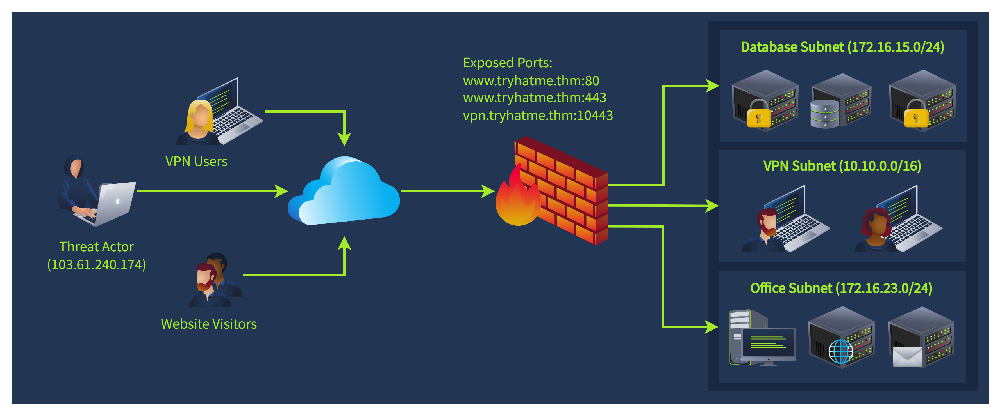

# SOC Workbooks and Lookups

**Identity Inventory**

Identity inventory is a catalogue of corporate employees (user accounts), services (machine accounts), and their details like privileges, contacts, and roles within the company.

**Asset Inventory**

Asset inventory, also called asset lookup, is a list of all computing resources within an organisation's IT environment. Note that while "asset" is a vague term and can also refer to software, hardware, or employees, this room emphasises servers and workstations only. 

**Network Diagram**

**workbooks Theory**

## **SOC Workbooks**

**SOC workbook**, also called playbook, runbook, or workflow, is a structured document that defines the steps required to investigate and remediate specific threats efficiently and consistently. Since L1 analysts are considered junior specialists and are not expected to triage every possible attack scenario perfectly, senior analysts often prepare workbooks to support their less experienced teammates. L1 analysts are recommended and sometimes even required to triage the alerts precisely according to workbooks to avoid mistakes and streamline the analysis.

                                           **Unusual Login Location Workbook**

1. **Enrichment**: Use Threat Intelligence and identity inventory to get information about the affected user
2. **Investigation**: Using the gathered data and  logs, make your verdict if the login is expected
    
    SIEM
    
3. **Escalation**: Escalate the alert to L2 or communicate the login with the user if necessary