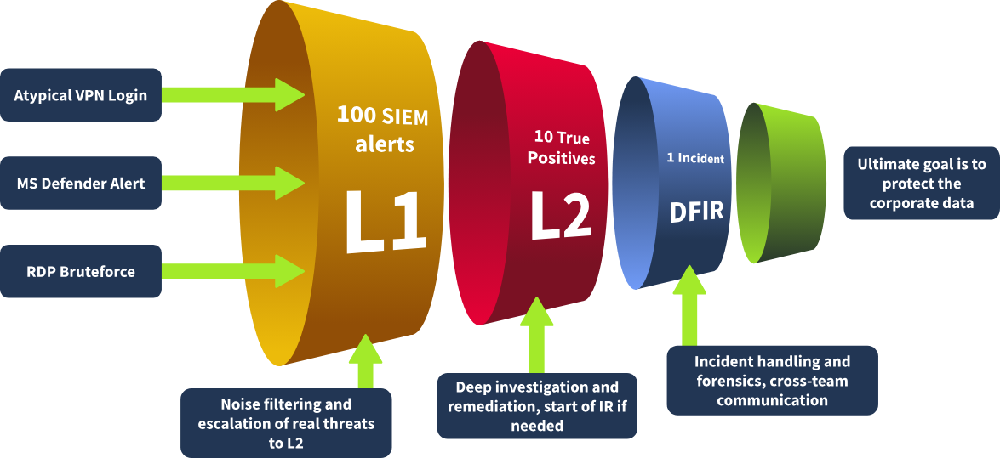

# SOC L1 Alert Reporting

In the previous room, you learned how to classify and triage the alerts. But you might be curious about what happens next. How does your triage help prevent threats and stop breaches? This is a whole new topic that this room will cover soon, but for now, let's recall the path of the alerts.

First, L1 analysts receive the alerts in a SIEM, EDR, or a ticket management platform. Most of the alerts are closed as False Positives or are handled on L1 level, but complex and threatening ones are sent to L2 that remediate most breaches. And to send the alerts further, you need to learn three new terms: reporting, escalation, and communication.

## **Alert Reporting**

Before closing or passing the alert to L2, you might have to report it. Depending on team standards and alert severity, instead of a short alert comment, you can be required to document your investigation in detail, ensuring all relevant evidence is included. This is especially important for True Positives, which require escalation.

## **Alert Escalation**

If the True Positive alert requires additional actions or deeper investigation, escalate it to the L2 analyst for further review following the agreed procedures. That's where your alert report comes in handy since L2 will use it to get the initial context and spend less on the analysis from scratch.

## **Communication**

You may also need to communicate with other departments during or after the analysis. For example, ask the IT team if they confirm granting administrative privileges to some users or contact HR to get more information about the newly hired employee.

Before we move on, it is essential to clarify why anyone would want L1 analysts to write reports in addition to marking them as True or False Positives and why this topic can not be underestimated. Having L1 analysts write alert reports serves several key purposes:

| **Alert Report Purpose** | **Explanation** |
| --- | --- |
| Provide context for escalation | • A well-written report saves lots of time for L2 analysts
• Also, it helps them quickly understand what happened |
| Save findings for the records | • Raw SIEM logs are stored for 3-12 months, but alerts are kept indefinitely
• As a result, it's better to keep all the context inside the alert, just in case |
| Improve investigation skills | • If you can't explain it simply, you don't understand it well enough
• Report writing is a great way to boost L1 skills by summarising alerts |

## **Report Format**

Imagine yourself as an L2 analyst, a DFIR team member, or an IT professional who needs to understand the alert. What would you want to see in the report? We recommend you follow the [**Five Ws**](https://en.wikipedia.org/wiki/Five_Ws) approach and include at least these items in the report:

- **Who**: Which user logs in, runs the command, or downloads the file
- **What**: What exact action or event sequence was performed
- **When**: When exactly did the suspicious activity start and ended
- **Where**: Which device, IP, or website was involved in the alert
- **Why**: The most important W, the reasoning for your final verdict

## **Escalation Guide**

**SOC Dashboard Escalation**

1. Move the alert to **In Progress** status and do the analysis
2. Write an alert report and set your **verdict**, such as True Positive
3. If escalation is required, assign the alert **to your L2** on shift
4. L2 will receive a notification and start from your alert report

**SOC Communication**

**Communication Cases**

- **You need to escalate an urgent, critical alert, but L2 is unavailable and does not respond for 30 minutes.**
    
    Ensure you know where to find emergency contacts. First, try to call L2, then L3, and finally your manager.
    
- **The alert about Slack/Teams account compromise requires you to validate the login with the affected user.**
    
    Do not contact the user through the breached chat - use alternative contact methods like a phone call.
    
- **You receive an overwhelming number of alerts during a short period of time, some of which are critical.**
    
    Prioritise the alerts according to the workflow, but inform your L2 on shift about the situation.
    
- **After a few days, you realise that you misclassified the alert and likely missed a malicious action.**
    
    Immediately reach out to your L2 explaining your concerns. Threat actors can be silent for weeks before impact.
    
- **You can not complete the alert triage since the SIEM logs are not parsed correctly or are not searchable.**
    
    Do not skip the alert - investigate what you can and report the issue to your L2 on shift or SOC engineer.
    

