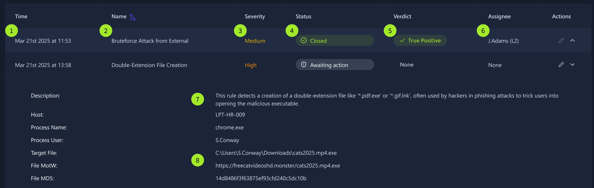

# SOC L1 Journey

### **SOC L1 Alert Triage**

An A**lert** is a core concept for any SOC team, and knowing how to handle it properly ultimately decides whether a security breach is detected and prevented, or missed and devastating.

**From Events to Alerts**

First, an event must occur, like user login, process launch, or file download. Then, the system, like your OS, a firewall, or a cloud provider must log the event. After that, all system logs must be shipped to a security solution like SIEM or EDR. The SOC team can receive millions of logs per day from thousands of different systems, where most of the events are expected, but some require attention. **Alert**, a notification generated by a security solution when a specific event or sequence of events occurs, is what saves SOC analysts from manual log review by highlighting only suspicious, anomalous events. With alerts, analysts triage just dozens of alerts per day instead of millions of raw logs.

**Alert Management Platforms**

| **Solution** | **Examples** | **Description** |
| --- | --- | --- |
| SIEMSystem | Splunk ES, Elastic | SIEM have solid alert management capabilities and are a perfect choice for most SOC teams |
| EDR orNDR | MS Defender,CrowdStrike | While EDR and NDR provide their own alert dashboards, it is preferred to use SIEM or SOAR |
| SOARSystem | Splunk SOAR,Cortex SOAR | Bigger SOC teams can use SOAR to aggregate and centralise alerts from multiple solutions |
| ITSMSystem | Jira,TheHive | Some teams may have a custom ticket management (ITSM) setup using a dedicated solution(The GIF above is taken from Trello, a simple tool that can be adapted to ITSM needs) |

**L1 Role in Alert Triage**

SOC L1 analysts are the first line of defence, and they are the ones who work with alerts the most. Depending on various factors, L1 analysts may receive zero to a hundred alerts a day, every one of which can reveal a cyberattack. Still, everyone in the SOC team is somehow involved in the alert triage:

- **SOC L1 analysts:**  Review the alerts, distinguish bad from good, and notify L2 analysts in case of a real threat
- **SOC L2 analysts:**  Receive the alerts escalated by L1 analysts and perform deeper analysis and remediation
- **SOC engineers:**  Ensure the alerts contain enough information required for efficient alert triage
- **SOC manager:**  Track speed and quality of alert triage to ensure that real attacks won't be missed

**Alert Properties**

**Picking the Right Alert**

- Filter the alerts
- Sort by severity
- Sort by time

**Alert Triage**

